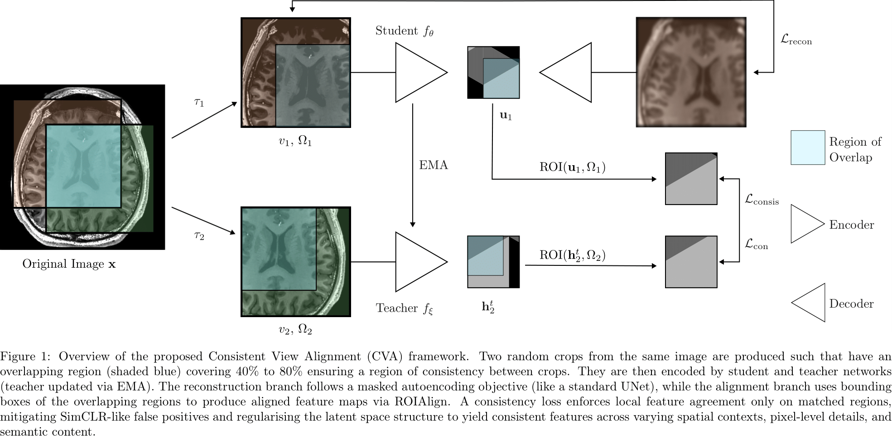
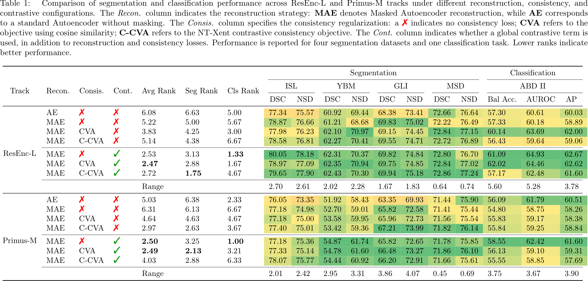

# Consistent View Alignment
## Consistency-Based SSL for 3D Medical Imaging



This repository builds on [OpenMind (nnSSL)](link-to-original-repo) and extends it with novel architectures, training strategies, and losses for the **Self-Supervised Learning for 3D Medical Imaging Challenge**.

We (team **The\_Latent\_Campus**) achieved **🥇 1st place in Track Primus-M** and **🥈 2nd place in Track ResEnc-L**, demonstrating the effectiveness of our consistency-based approach.

---

## 🔧 Contributions

Compared to the original repository, we introduce the following key components:

### **Architectures**

* `nnssl/architectures/consis_arch.py` adds:

  * **ResEnc-L** and **Primus-M** with projector–predictor mechanisms.
  * Ability to extract both **volumetric feature maps** and **global pooled feature maps**.

### **Training**
* `nnssl/training/nnsslTrainer/aligned_mae`
  * Implemented a **symmetrized loss** that combines:

    * Contrastive learning
    * Masked autoencoders
    * Our proposed **consistent view alignment** strategy.

* Integrated into the trainer interface, consistent with the repo’s design.

### **Loss**
* `nnssl/training/loss/aligned_mae_loss.py`
  * A **composite loss** that unifies multiple objectives.
  * An **alignment utility** for 3D bounding box–based volumetric alignment.
  * A **reworked NT-Xent loss** capable of handling symmetrization.

---

## 🏆 Challenge Overview


### OpenMind Challenge

**MICCAI Challenge: Self-Supervised Learning for 3D Medical Imaging (SSL3D Challenge)**

The **Self-Supervised Learning for 3D Medical Imaging Challenge** provides a unified benchmark for evaluating SSL methods in medical imaging.
It addresses fragmentation in the field by standardizing:

* Pre-training datasets
* Model architectures
* Fine-tuning schedules
* Evaluation setups

This ensures fair and reproducible comparisons across SSL approaches.

We participated as **The\_Latent\_Campus** and ranked:

* **1st in Track Primus-M**
* **2nd in Track ResEnc-L**


### FOMO60K Challenge

**MICCAI Challenge: Towards Foundation Models for the Clinic**  

- **Track 1: Methods** – Pretrain on FOMO60K, a dataset of **60K+ clinical brain MRI scans** including artifacts and real-world variability.  
- **Track 2: Open** – Pretrain on **any dataset(s)** (public or private).  
- **Evaluation**: Few-shot learning on three clinical tasks:  
  * Infarct detection  
  * Meningioma segmentation  
  * Brain age estimation  

We participated **only in the Open Track**, using the **OpenMind dataset** as our pretraining source.  

- ⚠️ Results for FOMO60K are **still pending**. No additional ablations were performed. 
---

## 🔗 Finetuning Code Locations
- **Segmentation finetuning (both challenges)**: `src/nnunet_adaption`  
- **FOMO60K classification/regression**: `src/baseline-codebase`  
- **OpenMind classification finetuning**: [SSL3D_classification](https://github.com/constantinulrich/SSL3D_classification)  

---

## 📊 Our Testing and Ablations 



## 📊 Challenge Results

### SSL3D Challenge Results

Please find the final challenge results at the link:
* https://ssl3d-challenge.dkfz.de/leaderboard
* We are The_Latent_Campus
  * ResEnc-L Track: Position 2nd
  * Primus-M Track: Position 1st

### FOMO60k Challenge Results
* FOMO60K results: pending evaluation (Open Track and Segmentation only).
* We are LatentCampus
  * Task 1 - Infraction Detection (limited attempt due to unfamiliarty): 
  * Task 2 - Meningioma SegmentationL: 
  * Task 3 - Brain Age Regression (limited attempt due unfamiliarity): 

---

## Usage

Pre-process and format the data as you would for OpenMind as usual. Train the models as below.


```bash
# ResEnc-L
nnssl_train 745 onemmiso -tr AlignedMAEFTTrainer -p nnsslPlans -num_gpus 1 -pretrained_weights ${nnssl_results}/Dataset745_OpenMind/MAETrainer/fold_all/checkpoint_final.pth || true

#Primus-M
nnssl_train 745 onemmiso -tr AlignedMAEFTLR3EvaTrainer -p nnsslPlans -num_gpus 1 -pretrained_weights ${nnssl_results}/Dataset745_OpenMind/MAETrainer/fold_all/checkpoint_final.pth || true
```

----

## 📦 Pretrained Weights

Pretrained weights will be released soon on **Zenodo**. Stay tuned!

---

## 📖 Citation

Citation to our challenge report and paper.

Please also cite the original work this repo builds on:

```bibtex
coming soon!
```

---

## ⚖ License

This repository is released under the [Creative Commons Attribution-NonCommercial 4.0 International Public License](./LICENSE.md).

### Requirements

All requirements are the same as in the original repository, including dependencies for PyTorch, einops, thop, and other libraries.


