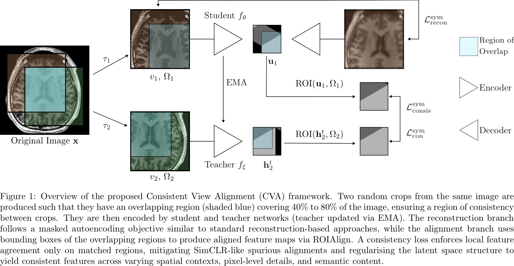

# Consistent View Alignment
## Consistency-Based SSL for 3D Medical Imaging



This repository builds on [OpenMind (nnSSL)](link-to-original-repo) and extends it with novel architectures, training strategies, and losses for the **Self-Supervised Learning for 3D Medical Imaging Challenge**.

We (team **The\_Latent\_Campus**) achieved **🥇 1st place in Track Primus-M** and **🥈 2nd place in Track ResEnc-L**, demonstrating the effectiveness of our consistency-based approach.

---

## 🔧 Contributions

Compared to the original repository, we introduce the following key components:

### **Architectures**

* `nnssl/architectures/consis_arch.py` adds:

  * **ResEnc-L** and **Primus-M** with projector–predictor mechanisms.
  * Ability to extract both **volumetric feature maps** and **global pooled feature maps**.

### **Training**
* `nnssl/training/nnsslTrainer/aligned_mae`
  * Implemented a **symmetrized loss** that combines:

    * Contrastive learning
    * Masked autoencoders
    * Our proposed **consistent view alignment** strategy.

* Integrated into the trainer interface, consistent with the repo’s design.

### **Loss**
* `nnssl/training/loss/aligned_mae_loss.py`
  * A **composite loss** that unifies multiple objectives.
  * An **alignment utility** for 3D bounding box–based volumetric alignment.
  * A **reworked NT-Xent loss** capable of handling symmetrization.

---

## 🏆 Challenge Overview


### OpenMind Challenge

**MICCAI Challenge: Self-Supervised Learning for 3D Medical Imaging (SSL3D Challenge)**

The **Self-Supervised Learning for 3D Medical Imaging Challenge** provides a unified benchmark for evaluating SSL methods in medical imaging.
It addresses fragmentation in the field by standardizing:

* Pre-training datasets
* Model architectures
* Fine-tuning schedules
* Evaluation setups

This ensures fair and reproducible comparisons across SSL approaches.

We participated as **The\_Latent\_Campus** and ranked:

* **1st in Track Primus-M**
* **2nd in Track ResEnc-L**


### FOMO60K Challenge

**MICCAI Challenge: Towards Foundation Models for the Clinic**  

- **Track 1: Methods** – Pretrain on FOMO60K, a dataset of **60K+ clinical brain MRI scans** including artifacts and real-world variability.  
- **Track 2: Open** – Pretrain on **any dataset(s)** (public or private).  
- **Evaluation**: Few-shot learning on three clinical tasks:  
  * Infarct detection  
  * Meningioma segmentation  
  * Brain age estimation  

We participated **only in the Open Track**, using the **OpenMind dataset** as our pretraining source.  

- ⚠️ Results for FOMO60K are **still pending**. No additional ablations were performed. 
---

## 🔗 Finetuning Code Locations
- **Segmentation finetuning (both challenges)**: `src/nnunet_adaption`  
- **FOMO60K classification/regression**: `src/baseline-codebase`  
- **OpenMind classification finetuning**: [SSL3D_classification](https://github.com/constantinulrich/SSL3D_classification)  

---

## 📊 Our Testing and Ablations 


## 📊 Challenge Results

### SSL3D Challenge Results

Please find the final challenge results at the link:
* https://ssl3d-challenge.dkfz.de/leaderboard
* We are The_Latent_Campus
  * ResEnc-L Track: Position 2nd
  * Primus-M Track: Position 1st

### FOMO60k Challenge Results
* FOMO60K results: pending evaluation (Open Track and Segmentation only).
* We are LatentCampus
  * Task 1 - Infraction Detection (limited attempt due to unfamiliarty): 
  * Task 2 - Meningioma SegmentationL: 
  * Task 3 - Brain Age Regression (limited attempt due unfamiliarity): 

---

## Usage

Pre-process and format the data as you would for OpenMind as usual. Train the models as below.


```bash
# ResEnc-L
nnssl_train 745 onemmiso -tr AlignedMAEFTTrainer -p nnsslPlans -num_gpus 1 -pretrained_weights ${nnssl_results}/Dataset745_OpenMind/MAETrainer/fold_all/checkpoint_final.pth || true

#Primus-M
nnssl_train 745 onemmiso -tr AlignedMAEFTLR3EvaTrainer -p nnsslPlans -num_gpus 1 -pretrained_weights ${nnssl_results}/Dataset745_OpenMind/MAETrainer/fold_all/checkpoint_final.pth || true
```

----

## 📦 Pretrained Weights

Pretrained weights will be released soon on **Zenodo**. Stay tuned!

---

## 📖 Citation

Citation to our challenge report and paper.

Please also cite the original work this repo builds on:

```bibtex
@article{vaishConsistentViewAlignment2025,
  title = {Consistent View Alignment Improves Foundation Models for {{3D}} Medical Image Segmentation},
  author = {Vaish, Puru and Meister, Felix and Heimann, Tobias and Brune, Christoph and Wolterink, Jelmer M.},
  year = {2025},
  month = sep,
  number = {arXiv:2509.13846},
  eprint = {2509.13846},
  primaryclass = {cs},
  publisher = {arXiv},
  doi = {10.48550/arXiv.2509.13846},
  url = {http://arxiv.org/abs/2509.13846},
  urldate = {2025-09-19},
  abstract = {Many recent approaches in representation learning implicitly assume that uncorrelated views of a data point are sufficient to learn meaningful representations for various downstream tasks. In this work, we challenge this assumption and demonstrate that meaningful structure in the latent space does not emerge naturally. Instead, it must be explicitly induced. We propose a method that aligns representations from different views of the data to align complementary information without inducing false positives. Our experiments show that our proposed self-supervised learning method, Consistent View Alignment, improves performance for downstream tasks, highlighting the critical role of structured view alignment in learning effective representations. Our method achieved first and second place in the MICCAI 2025 SSL3D challenge when using a Primus vision transformer and ResEnc convolutional neural network, respectively. The code and pretrained model weights are released at https://github.com/Tenbatsu24/LatentCampus.},
  archiveprefix = {arXiv},
  langid = {english},
  keywords = {Computer Science - Computer Vision and Pattern Recognition,Computer Science - Machine Learning},
}
```

---

## ⚖ License

This repository is released under the [Creative Commons Attribution-NonCommercial 4.0 International Public License](./LICENSE.md).

### Requirements

All requirements are the same as in the original repository, including dependencies for PyTorch, einops, thop, and other libraries.


